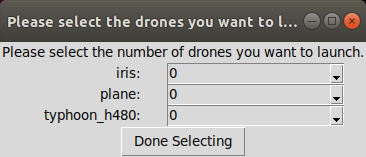
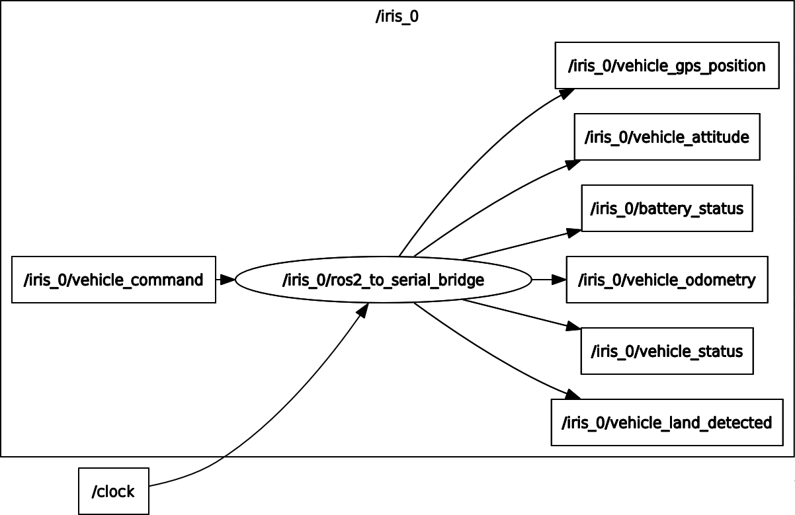
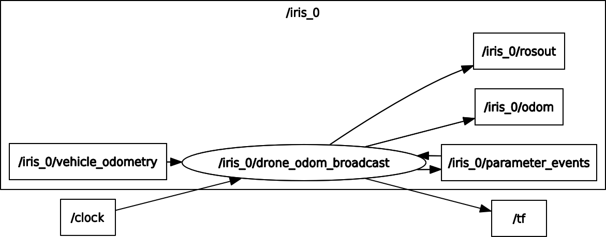
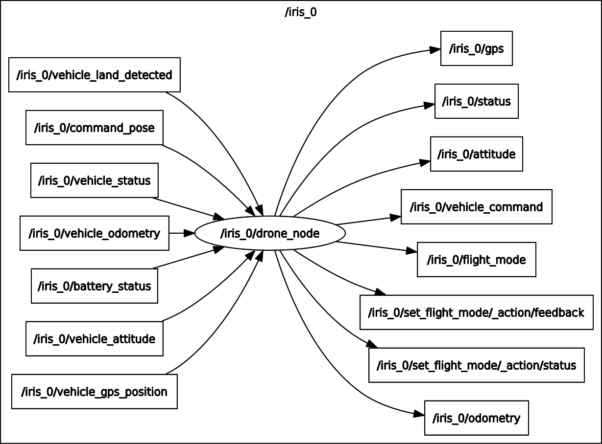
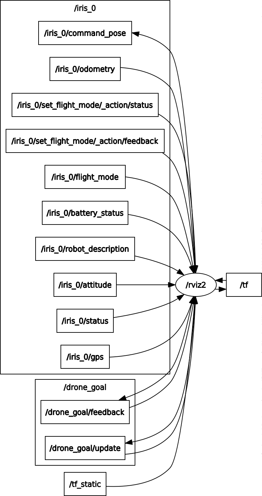

This repository contains the contents for a drone demonstration.

It is running Gazebo, PX4, QGroundControl and several other components.

You will need `rocker` `docker` and `nvidia-docker` installed. See the prerequisite instructions here:

https://github.com/osrf/px4sitl/blob/master/install.md


There are also some notes about how to make it work without an nvidia card as well. Mileage may vary.

To run the demo from the hosted docker images you can simply invoke

`rocker --x11 --nvidia --user --home --pulse tfoote/drone_demo`

## Modifying or building your own

See the Dockerfiles and docs in the `docker_deploy` branch: https://github.com/osrf/drone_demo/tree/docker_deploy

## What you'll see when you launch

By default it will launch gazebo headless, QGroundControl, and a small python script that will prompt you for how many of what type of drones to launch.

You can select up to 4 total drones.

After that gazebo models of the instances will be spawned with appropriately parameterized PX4 autopilots connected.
Once they have initialized you can interact with them via QGroundControl.


### Changing Behavior

If you'd like to change behavior you can pass argumets with a command like this:

`rocker --x11 --nvidia --user --home --pulse tfoote/drone_demo roslaunch sitl_launcher demo.launch gui:=false sitl_world:=yosemite`

`gui:=true` will enable the Gazebo head

Other valid sitl_worlds are: `mcmillan`, `ksql`, and `baylands`.

You can also pass arguments via `drone_args` to skip the drone selector gui and immediately start the selected drones.

The script is here: https://github.com/osrf/drone_demo/blob/master/sitl_launcher/scripts/launch_drone


## Docs

This drone demonstrator runs Gazebo, PX4, QGroundcontrol, and some other ROS 2.0 components. In this section we will provide some details about the inner ROS 2.0 architecture.

### Gazebo and PX4

The launchfile demo.launch.py creates the Gazebo world and also it launches an GUI to select the drones that you want to include in the world. The GUI has the following aspect:



When you have selected the drones and clicked in the "Done Selecting" button, this node will expand in the world the drones. Each one of the drones will launch a PX4 instance. These instances connect with a bridge called [ros2_to_serial_bridge](https://github.com/osrf/ros2_serial_example/tree/master/ros2_serial_example) with converts the uORB messages into ROS 2 `px4_msgs` messages.

Inside PX4 code there is a file called `uorb_rtps_message_ids.yaml` which defines the publishers and subscribers that the bridge will connect. For example, the `battery_status` message will be send by the PX4 uORB publisher and the bridge will republish this message into the ROS 2 network using `px4_msgs/BatteryStatus` message. Something similar happens with subscriber like `vehicle_command` which is defined as `receive`, the bridge will create a subscriber with `px4_msgs/VehicleCommand` message and this will be republish into the PX4 uORB network.

```yaml
- msg: battery_status
  id: 6
  send: true
...
- msg: vehicle_command
  id: 89
  receive: true
```

Gazebo launches some nodes thanks to some of the plugins running for each drone. It creates a camera node and joint state publisher node which will allow us to visualize the model in RVIZ2.

**NOTES**
 - In the official documentation of PX4 you can find [more details](https://dev.px4.io/v1.9.0/en/middleware/micrortps.html#ros2ros-application-pipeline)
 - If you want to understand how the `ros2_serial_bridge` works there is an extense [readme](https://github.com/osrf/ros2_serial_example).

## ROS 2

### ros2_to_serial_bridge

Based on the section above we will have a node publishing some topics:

  - `/iris_0/vehicle_gps_position`: GPS position in WGS84 coordinates.
  - `/iris_0/vehicle_attitude`: it contains the rotation from XYZ body frame to NED earth frame.
  - `/iris_0/vehicle_status`: it contains internal information about the drone such us arming state, flight mode, etc
  - `/iris_0/battery_status`: it contains data about the voltage, cells, etc
  - `/iris_0/vehicle_land_detected`: it contains information about the landing state
  - `/iris_0/vehicle_odometry`: Fits ROS REP 147 for aerial vehicles

and one subscription to:

 - `/iris_0/vehicle_command`: it allows us to send commands to the drone

 

### drone_odom_broadcast

This node is subscribed to `vehicle_odometry` topic from  `ros2_serial_bridge` node. This node publish the `odom` topic and broadcast the corresponding transforms to `tf`.



### drone_node

This node converts the `px4_msgs` messages generated by the `ros2_to_serial_bridge` node to [REP 147 messages](https://www.ros.org/reps/rep-0147.html)



#### Publishers:
 - `battery_status` publish `Sensor_msgs/baterryState` message.
 - `flight_mode` publish `proposed_aerial_msgs::msg::FlightMode`
 - `vehicle_status` publish `proposed_aerial_msgs::msg::VehicleStatus`
 - `odometry` publish `nav_msgs::msg::Odometry`
 - `vehicle` publish `command px4_msgs::msg::VehicleCommand`
 - `vehicle_gps_position` publish `sensor_msgs::msg::NavSatFix`
 - `attitude` publish `proposed_aerial_msgs::msg::Attitude`


#### Subscribers:

 - `command_pose` is subscribed to `geometry_msgs::msg::PoseStamped`

#### Actions

 - `set_flight_mode` creates the action `proposed_aerial_msgs::action::SetFlightMode`

### RVIZ 2

RVIZ2 is subscribed to topics coming from `drone_noede` node and tf. Using the interface you can also send some commands.



There is more documentation about how to use rviz_aerial_plugins [here](https://github.com/osrf/rviz_aerial_plugins)
